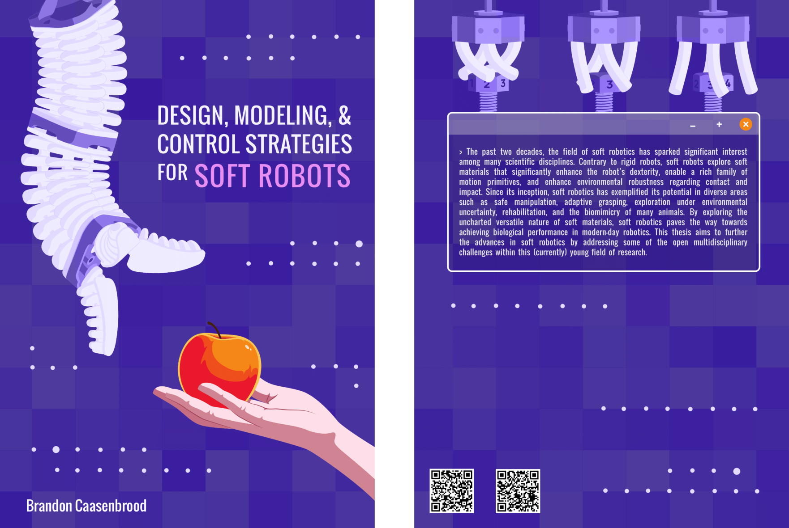

Design, Modeling, & Control Strategies for Soft Robots
========================================================



Ph.D. dissertation, Brandon Caasenbrood, January 2024. Defended on January 10, 2024. 

- To view the thesis, [please click here](https://nbviewer.org/github/BJCaasenbrood/thesis/blob/master/phd-thesis-Caasenbrood2024.pdf).
- To view the propositions accompanying the thesis, [please click here](https://nbviewer.org/github/BJCaasenbrood/thesis/blob/master/phd-propositions-Caasenbrood2024.pdf).

Please cite using the following BibTex entry:

```
@phdthesis{caasenbrood2024,
  title={Design, Modeling, and Control Strategies for Soft Robots},
  author={Caasenbrood, Brandon},
  school={Eindhoven University of Technology, the Netherlands},
  year=2024,
  month=1,
  note={https://doi.org/10.6100/3fmj-dg12}
}
```
**License:** CC-BY-AS  
**DOI:** https://doi.org/10.6100/3fmj-dg12  
**Contact:** Brandon Caasenbrood (<b.j.caasenbrood@gmail.com>)  

---
### Public PhD defense Brandon Caasenbrood (Cum Laude)
**Click on image for the video**

[](https://www.youtube.com/watch?v=ihmIj9PDeaQ)

---
#### Abstract
In the past two decades, the field of soft robotics has sparked significant interest among many scientific disciplines. Contrary to rigid robots, soft robots explore soft materials that significantly enhance the robot's dexterity, enable a rich family of motion primitives, and enhance environmental robustness regarding contact and impact. Since its inception, soft robotics has exemplified its potential in diverse areas such as safe manipulation, adaptive grasping, exploration under environmental uncertainty, rehabilitation, and the biomimicry of many animals. By exploring the uncharted versatile nature of soft materials, soft robotics paves the way towards achieving biological performance in modern-day robotics. This thesis aims to further the advances in soft robotics by addressing some of the open multidisciplinary challenges within this young field of research.

Although soft materials harbor many advantages akin to biology, which are difficult to achieve for rigid robotics, they also pose many fundamental problems. The first issue is the problem of soft robotic design. Traditional robotic design emphasizes high structural rigidity and weight minimization, a well-established practice in engineering. On the other hand, soft robotic design values minimal structural rigidity for motion, leading to complex, highly nonlinear relationships between the input and output. Additionally, distributed soft actuation, in addition to gravitational and inertial forces acting on the continuous elastic body, introduces joint mobilities that are often uncontrollable nor aligned with the control objective, *e.g.*, precise grasping and manipulation. Since describing the underlying continuum mechanics and applying such mathematical theory to systematic design is challenging, a large number of soft robotic systems are still developed *ad hoc*.

Second, a direct duality of the previous challenge is dealing with the innate infinite-dimensionality from a control perspective -- particularly with model-based feedback in mind. The transition from rigid to flexible has introduced a new control paradigm: the trade-off between precision and speed in a numerical setting. Not only is control theory for soft robotics in stages of inception, but deriving accurate and numerically efficient model-based controllers is challenging due to the large nonlinear deformations of the soft robotic body.

In light of these challenges, this thesis proposes a set of systematic tools with theoretical and experimental applications for *(i)* the structural design and fabrication of continuum-deformable soft actuators optimized for user-defined joint motion, *(ii)* the development of efficient dynamic models of soft continuum manipulators, and *(iii)* applying such mathematical models to model-based controllers for a subclass of (pneumatic) soft continuum manipulators and soft grippers.

The first part of the thesis addresses the design problem by proposing a novel automated design algorithm for developing efficient soft actuators. These algorithms account for the underlying continuum mechanics described by a set of partial differential equations, which respect the aforementioned nonlinearities between the input and output motion. Tailoring user-defined cost functions to desired motion and control reachability, an implicit representation of the optimal soft material distribution can be found within a fixed design space. Several generative designs for a diverse subset of soft actuation morphologies are produced including, but not limited to, soft rotational actuators, soft artificial muscles, and soft grippers. In what follows, an optimal design for a soft actuator is synthesized; and through Additive Manufacturing (AM) of printable flexible material, the sim-to-real boundary is passed. The proposed approach not only accelerates design convergence but also builds upon the vast library of soft robot morphologies currently unexplored in literature.

The second part of the thesis addresses the question of modeling for control applicable to a class of soft robotic systems -- most notably soft continuum manipulators. The thesis proposes a reduced-order modeling strategy for soft robotics, whose dynamics are derived through differential geometric theory on spatial beams. Besides discussing earlier modeling strategies, the thesis also proposes a new strain-based parametrization approach that ensures the structural information and the underlying continuum mechanics are preserved when synthesizing the reduced-order beam models -- a possible solution to the aforementioned control paradigm of precision vs. speed. To enhance numerical performance further, spatio-temporal integration schemes are also proposed that exploit the geometric structure of such soft beam models, resulting in real-time simulation with sufficient numerical precision purposefully tailored for control.

The third part of the thesis addresses the development of model-based controllers that can be employed in various control scenarios similar to control for traditional rigid robotics, *e.g.*, inverse kinematics and motion planning, set-point stabilization, trajectory tracking, and multi-point grasping of objects. The stabilizing controller is rooted in an energy-based formalism, providing robustness even when faced with material uncertainties. The effectiveness of the controller is demonstrated both in simulation and experiments for various soft robotic systems that share a resemblance to biology, *e.g.*, the elephant's trunk or the tentacle of an octopus.

The main contribution of the thesis is a collection of multidisciplinary tools compressed into one general framework for the design, modeling, and control of a class of soft robots, ranging from the theoretical to the experimental domain.

---
#### Propositions

The propositions[^1] accompanying the dissertation: "Design, Modeling, and Control Strategies for Soft Robots"

1. The remarkable adaptability and functionality of biological organisms are not merely a consequence of their morphology but emerge from the interplay between structure and coordinated motor control. To mimic such features, soft robotic design must be inspired from similar principles. (This thesis)

2. Regarding both the topology and material as unknown properties in the design optimization for soft robotics is essential in discovering new mechanical configurations, which may not be found when either is assumed to be known. (This thesis, Chapter 3)

3. Model-based controllers for soft robots must incorporate feedback controllers that aim to preserve the intrinsic compliance of soft materials as to enable efficient "*life-like*" motion. (This thesis, Chapter 5)

4. Soft robots, with their seemingly infinite degrees of freedom, can be adeptly managed by reduced-order controllers that target only a few principle modes of operation.%, focusing on the robots' inherent redundancy to cut through the complexity. (This thesis, Chapter 5 and 6)

5. Any publication on soft robots would benefit from answering the "*Why soft?*" question, instead of adopting a "*Soft for soft's sake*" philosophy. (Inspired by "*Hard questions for soft robotics*" written by Hawkes et al., Science (2021))

6. While fluidic actuation has been instrumental in the development of soft robotics, its dominance may limit the progress in areas such as bandwidth, scalability, and autonomy.

7. For scientific disciplines to truly converge in a collaborative context, a common terminology must be prioritized first.

8. Academic publishers, aiming to improve transparency, reduce the potential for fraud, and encourage replicability within the realm of data-driven research, ought to establish code and data-sharing policies that are designed to enable automated replication.

9. The increasing sensationalization of the media regarding science underlines that in academic writing, "*the liveliness of the exposition is as necessary as lucidity.*" (Inspired by "Popularisation and Sensationalism" in Nature's newsletter (1924)) 

10. Most of our frustrations with others stems from the fact that we have an innate inability to understand other people fully.

11. The pursuit of personal achievements should not come at the expense of friendship.

[^1]: Propositions (or "*stellingen*" in Dutch) are a set of statements that the PhD candidate formulates and may include alongside their dissertation. They cover both specific findings of the research and broader academic or societal issues, serving as a starting point for critical discussion during the defense ceremony.
